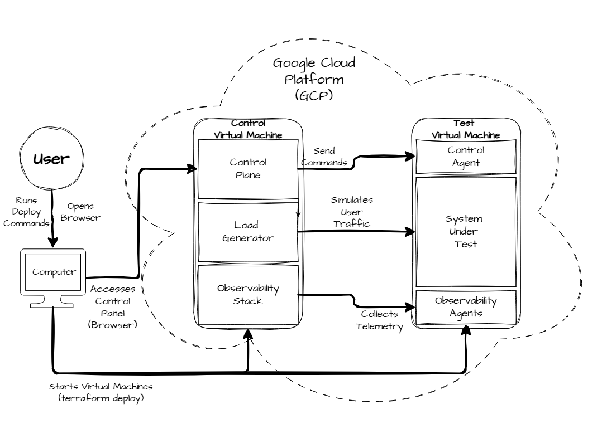
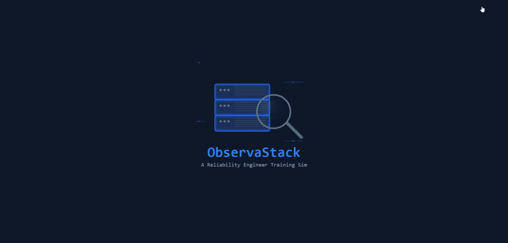

# ObservaStack

A one-command reliability engineer training simulator for improving system debugging skills.

## What it is

ObservaStack is a platform for learning core system ownership and operational health skills, featuring:

- **System Under Test (SUT)**: A reverse proxy (Nginx) fronting a multi-process API server (FastAPI) instrumented to generate metrics, logs, and traces.
- **Scenario Control Panel**: Web UI for launching scenarios, querying the SUT, and accessing observability tools.
- **Integrated Load Generator**: A system for creating repeatable load patterns (Locust) to simulate realistic traffic.
- **Full observability**: Prometheus metrics, Loki logs, Tempo traces, Pyroscope profiles, and Grafana Dashboards—the same tools SREs use in production
- **Easy Deployment**: Run locally with docker or on GCP with terraform and connect securely with IAP Tunnels. 

Once you clone the repository you can have a monitored system running in minutes. Test it, break it, fix it, and learn.

## Current State

Work-in-progress: See the [mvp design doc](docs/mvp.md).

ETA: December 2026 for MVP

## Why it was made

Learning incident response the traditional way means waiting for production systems to break—which is stressful, high-stakes, and offers no chance to practice. Tutorials and toy examples don't prepare you for real debugging because they lack the complexity and observability of production systems.

ObservaStack bridges this gap by providing:

- **Realistic failures**: Configuration regressions, resource exhaustion, dependency failures, retry amplification—not just "container crashed".
- **Safe practice environment**: Break things, try fixes, learn from mistakes without impacting real users.
- **Pre-configured Dashboards**: Golden Signals monitoring (Latency, Errors, Traffic, Saturation) ready out of the box to help build intuition for reasoning about system health.
- **Repeatable scenarios**: Same failure pattern every time, enabling deliberate practice and skill assessment. 
- **Easily Extendable**: Create test scenarios composed of specific load patterns, system configurations, and hints to provide to the user.

Whether you're preparing for oncall, interviewing for SRE roles, or training a team, ObservaStack lets you build operational skills before production incidents demand them. 

See [user journeys](docs/user-journeys.md) for the targeted use cases.

## Quick Start

The entire project can be run on your home computer or in the cloud, see the following sections for getting started.

### Resource Requirements

**Minimum:**

+ CPU: 1 Core on a modern architecture.
+ RAM: 2 GiB

**Recommended:**

+ CPU: 2 Cores on a modern architecture.
+ RAM: 4 GiB

### Local Deployment (Your Computer)

Deploy the project on a local machine.

**Requires:**

1. [Docker Desktop](https://www.docker.com/products/docker-desktop) (or Docker Engine + Docker Compose)
2. [Git](https://git-scm.com/download/win) to clone the repository

**Instructions:**

```bash
# Clone the project and deploy it on your machine
git clone https://github.com/CharlesDDNoble/ObservaStack.git
cd ObservaStack
docker compose --env-file deploy/docker/.env.local up -d

# Control Panel:    http://localhost
# Grafana:          http://localhost:3000 (admin/admin)
```

## How it works

See [Acknowledgements](#acknowledgements) for links to the technologies used.

### Components

1. **The SUT**: A common production-grade application stack (Nginx/FastAPI/Gunicorn).
1. **The Observability Stack**: Industry standard observability pipeline (Grafana/Prometheus/Loki/Tempo/Pyroscope).
1. **The Control Plane**: A system for orchestrating test scenarios with a modern UI Control Panel (React/tailwindCSS/shadcn).
1. **The Load Generator**: A load generator (Locust) for reliably triggering specific load patterns on the SUT.
1. **Deployment**: Platform agnostic and cloud native using Docker containers for everything. Deploy locally or in the cloud.



For a more detailed layout view the [detailed architecture](docs/detailed-diagram.png).

### Project Structure

```
ObservaStack/
├── control/                    # Control plane components
│   ├── frontend/               #     Frontend Control Panel
│   ├── orchestrator/           #     Scenario Orchestrator and system manager
│   └── gateway/                #     Control Gateway (serves frontend & routes requests)
├── sut/                        # System Under Test (the system being monitored)
│   ├── application/            #     Gunicorn/FastAPI API Server
│   ├── controller/             #     Control Agent for executing privileged commands
│   ├── secure-gateway/         #     Forwards commands from orchestrator to the controller     
│   ├── observability-gateway/  #     Forwards telemetry traffic to APIServer / Gateway Status exporter
│   └── sut-gateway/            #     Forwards user path traffic to the API Server
├── observability/              # Prometheus, Loki, Grafana, Tempo, Pyroscope configs
├── testing/                    # Locust load testing suite
├── deploy/                     # Deployment configurations
│   ├── docker/                 #   Docker Compose files for local deployment
│   └── terraform/              #   GCP deployment with Terraform + IAP for securing the connection
├── docker-compose.yml          # Root docker compose file
└── docs/                       # Architecture diagrams and design docs
```

## Demos

### Control Panel



### Acknowledgements

**All AGPL components are being used via unmodified, official images.**

This project is built on the shoulders of incredible open-source tools. A huge thank-you to the teams and communities behind:

### The Observability Stack

* **[Grafana](https://grafana.com/)**: (License: **AGPLv3**): [License Text](https://www.gnu.org/licenses/agpl-3.0.en.html)
* **[Loki](https://grafana.com/oss/loki/)**: (License: **AGPLv3**): [License Text](https://www.gnu.org/licenses/agpl-3.0.en.html)
* **[Tempo](https://grafana.com/oss/tempo/)**: (License: **AGPLv3**): [License Text](https://www.gnu.org/licenses/agpl-3.0.en.html)
* **[Pyroscope](https://grafana.com/oss/pyroscope/)**: (License: **AGPLv3**): [License Text](https://www.gnu.org/licenses/agpl-3.0.en.html)
* **[Prometheus](https://prometheus.io/)**: (License: **Apache 2.0**): [License Text](https://www.apache.org/licenses/LICENSE-2.0)

### The Application Stack

* **[React](https://reactjs.org/)**: (License: **MIT**): [License Text](https://opensource.org/licenses/MIT)
* **[FastAPI](https://fastapi.tiangolo.com/)**: (License: **MIT**): [License Text](https://opensource.org/licenses/MIT)
* **[Nginx](https://www.nginx.com/)**: (License: **2-Clause BSD**): [License Text](https://opensource.org/licenses/BSD-2-Clause)
* **[Gunicorn](https://gunicorn.org/)**: (License: **MIT**): [License Text](https://opensource.org/licenses/MIT)

### The Frontend UI

* **[Tailwind CSS](https://tailwindcss.com/)**: (License: **MIT**): [License Text](https://opensource.org/licenses/MIT)
* **[shadcn/ui](https://ui.shadcn.com/)**: (License: **MIT**): [License Text](https://opensource.org/licenses/MIT)
* **[Apache ECharts](https://echarts.apache.org/)**: (License: **Apache 2.0**): [License Text](https://www.apache.org/licenses/LICENSE-2.0)

### The Testing & Deployment Suite

* **[Locust](https://locust.io/)**: (License: **MIT**): [License Text](https://opensource.org/licenses/MIT)
* **[Docker](https://www.docker.com/)**: (License: **Apache 2.0**): [License Text](https://www.apache.org/licenses/LICENSE-2.0)
* **[Terraform](https://www.terraform.io/)**: (License: **Business Source License**): [License Text](https://github.com/hashicorp/terraform/blob/main/LICENSE)

## Contributing

Suggestions are welcome and encouraged, but the project is currently closed for contributions for the time being.

## License and Compliance

This project is licensed under the **AGPLv3 License**.

* The full text of the AGPLv3 license can be found in the **[LICENSE](LICENSE)** file.
* For compliance with the licenses (MIT, Apache 2.0, AGPLv3, etc.) of all third-party components used, please refer to the **[NOTICE](NOTICE)** file for required copyright and license acknowledgments.

## A Word from the author

Share this, learn from it, and teach others!
