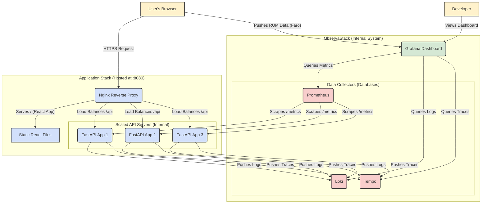

```mermaid
graph TD
    %% === Define Node Styles ===
    classDef app fill:#D2E0FB,stroke:#333,stroke-width:2px
    classDef o11y fill:#D5E8D4,stroke:#333,stroke-width:2px
    classDef user fill:#FFF2CC,stroke:#333,stroke-width:2px
    classDef db fill:#F8CECC,stroke:#333,stroke-width:2px

    %% === Actors ===
    User[User's Browser]:::user
    Developer[Developer]:::user

    %% === Application Stack ===
    subgraph "Application Stack (Hosted at :8080)"
        direction LR
        Nginx(Nginx Reverse Proxy):::app
        
        subgraph "Scaled API Servers (Internal)"
            direction TB
            FastAPI1(FastAPI App 1):::app
            FastAPI2(FastAPI App 2):::app
            FastAPI3(FastAPI App 3):::app
        end

        React[Static React Files]:::app
    end

    %% === Observability Stack ===
    subgraph "ObservaStack (Internal System)"
        direction TB
        
        subgraph "Data Collectors (Databases)"
            direction TB
            Prometheus(Prometheus):::db
            Loki(Loki):::db
            Tempo(Tempo):::db
        end

        Grafana(Grafana Dashboard):::o11y
    end

    %% === Define Relationships ===

    %% 1. User Request Flow
    User -- "HTTPS Request" --> Nginx
    Nginx -- "Serves / (React App)" --> React
    Nginx -- "Load Balances /api" --> FastAPI1
    Nginx -- "Load Balances /api" --> FastAPI2
    Nginx -- "Load Balances /api" --> FastAPI3

    %% 2. Observability Data Export Flow
    FastAPI1 -- "Pushes Logs" --> Loki
    FastAPI1 -- "Pushes Traces" --> Tempo
    Prometheus -- "Scrapes /metrics" --> FastAPI1

    FastAPI2 -- "Pushes Logs" --> Loki
    FastAPI2 -- "Pushes Traces" --> Tempo
    Prometheus -- "Scrapes /metrics" --> FastAPI2
    
    FastAPI3 -- "Pushes Logs" --> Loki
    FastAPI3 -- "Pushes Traces" --> Tempo
    Prometheus -- "Scrapes /metrics" --> FastAPI3

    User -- "Pushes RUM Data (Faro)" --> Grafana 

    %% 3. Developer Dashboard Flow
    Developer -- "Views Dashboard" --> Grafana
    Grafana -- "Queries Metrics" --> Prometheus
    Grafana -- "Queries Logs" --> Loki
    Grafana -- "Queries Traces" --> Tempo
```